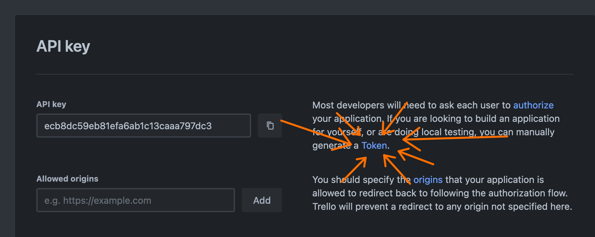
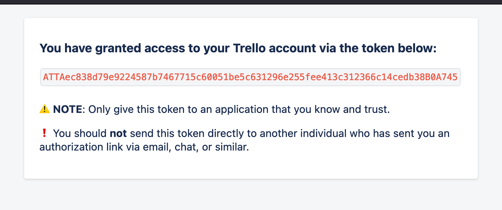

# Teknologiradar βeta

Teknologiradar med Trello backend.

# Local development

```shell
npm install
```

## Create a `.env.local` file in the root of the project

```shell
TRELLO_BOARD_ID=
TRELLO_API_KEY=
TRELLO_API_TOKEN=
```

## create a trello board (create account, click around in the web GUI, create the lists needed inside the board (bruk, vurder, avstå)... etc 🙌)

From the URL of the board you created, copy the `BOARD_ID` (eg. `https://trello.com/b/BOARD_ID/test-teknologiradar`) and paste it as `TRELLO_BOARD_ID`

## create a trello 'Power-Up' (prerequisite for generating API keys)

go to https://trello.com/power-ups/admin, create a new power-up, call it anything you want (I decided on `rest-api`), select your workspace (that the board is inside), leave the iframe connector URL blank (we don't need it), enter email and author name then hit `Create`.

## go to the `API key` sub-menu and click `Generate a new API key`

Copy the `API key` and paste as `TRELLO_API_KEY`

## now click the `token` link on the API key page



## now click `Allow`,



Copy the token it gives you and paste as `TRELLO_API_TOKEN`

## run the following to get an overview of the board's list ID's.

```shell
node scripts/get-trello-lists.mjs
```

look at the `src/lib/config.ts` and then populate the list ID's into the config file based on the output of the previous command.

## you should now be able to run the project and have it populated with the data from the trello board.

```shell
npm run dev
```

## Test and explore the Trello API

```shell
npx ts-node -r tsconfig-paths/register src/lib/test-trello.ts
```

---

# Henvendelser

Du kan sende spørsmål i Slackkanalen [#teknologiradar](https://nav-it.slack.com/archives/CEHSHMNBF).
